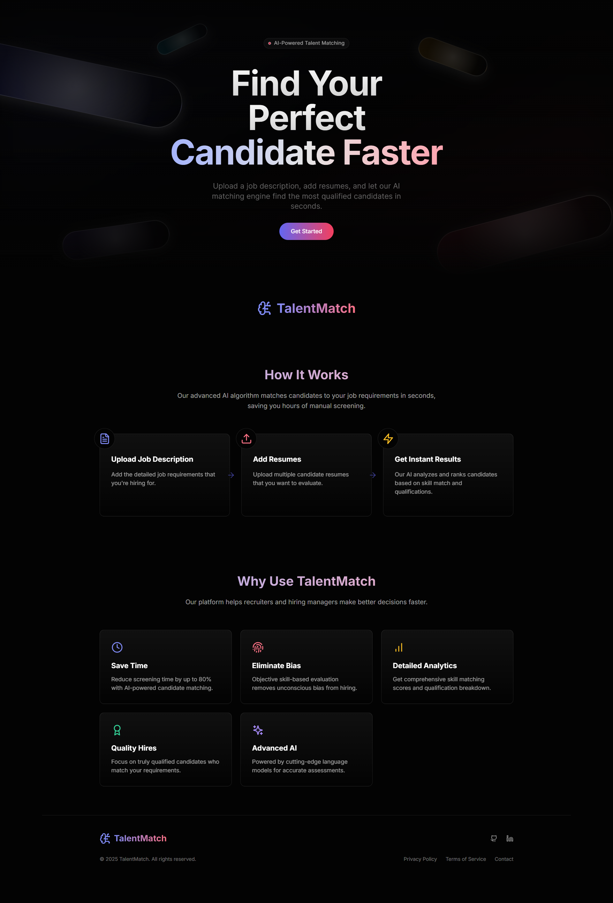
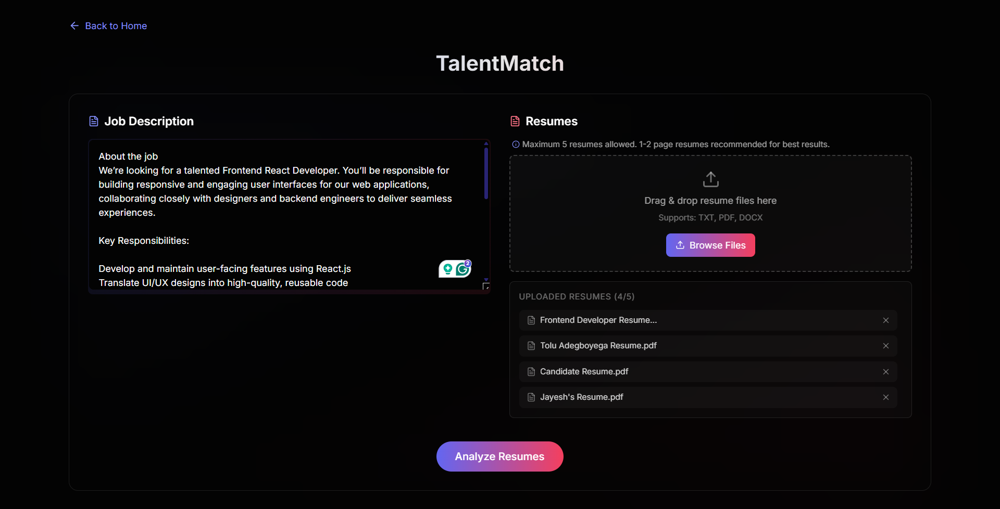
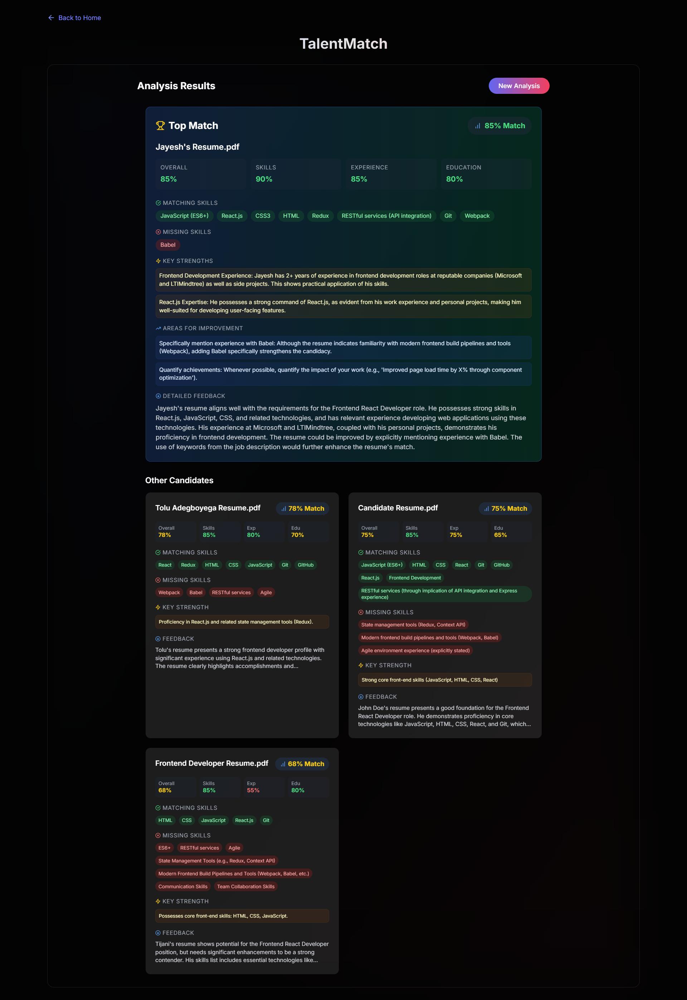

# TalentMatch


TalentMatch is an AI-powered resume matching application that helps recruiters and hiring managers quickly identify the most qualified candidates from a pool of resumes. By leveraging advanced AI technology, TalentMatch analyzes job descriptions and candidate resumes to provide comprehensive matching scores and detailed insights.

## ✨ Features

- **AI Resume Analysis**: Upload a job description and multiple resumes for instant AI-powered matching
- **Detailed Candidate Ranking**: View sorted candidates based on qualification match scores
- **Skill Gap Analysis**: Easily identify matching and missing skills for each candidate
- **PDF Resume Parsing**: Automatically extract text from PDF resumes
- **Clean Dark UI**: Beautiful, modern user interface optimized for productivity
- **Mobile Responsive**: Works on desktop, tablet, and mobile devices

## 🚀 Live Demo

Check out the live demo at [talentmatch.demo.com](https://talentmatch.demo.com)

## 📸 Screenshots

### Landing Page


### Resume Matching Interface


### Results Analysis


## 🔧 Technologies Used

- **React**: Frontend library for building the user interface
- **TypeScript**: Type-safe JavaScript
- **Tailwind CSS**: Utility-first CSS framework for styling
- **Framer Motion**: Animation library for smooth UI transitions
- **PDF.js**: For parsing and extracting text from PDF documents
- **Natural Language Processing**: For analyzing job descriptions and resumes

## 🛠️ Installation and Setup

1. Clone the repository:
```bash
git clone https://github.com/Shyam-Odedra/TalentMatch.git
cd TalentMatch
```

2. Install dependencies:
```bash
npm install
```

3. Add your Gemini API Key:
```bash
VITE_GOOGLE_GEMINI_API_KEY=your-api-key
```

4. Start the development server:
```bash
npm run dev
```

5. Build for production:
```bash
npm run build
```

## 📋 How to Use

1. **Navigate to the App**: Go to the main application page
2. **Add Job Description**: Paste or type the job description in the left panel
3. **Upload Resumes**: Drag and drop or browse to upload up to 5 candidate resumes (TXT, PDF, DOCX)
4. **Analyze**: Click the "Analyze Resumes" button to process and match
5. **Review Results**: Examine the detailed skills match, strengths, and improvement areas for each candidate
6. **Start Over**: Click "New Analysis" to clear all data and start fresh

## 🎯 Best Practices

- Keep job descriptions detailed but concise
- Upload 1-2 page resumes for optimal matching
- Include relevant skills and experience in both job descriptions and resumes
- Limit to 5 resumes per analysis for best performance